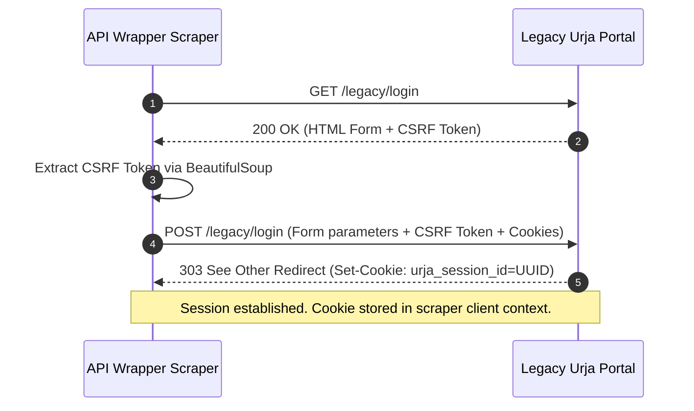

# Urja Legacy Portal Interfacing Protocol Specification

This document details the communication protocol, authentication handshake, CSRF negotiation, HTML scraping patterns, and data flow models used to build the production-grade REST API wrapper over the legacy Urja Meter Ops portal.

---

## 1. Authentication Handshake & Session Persistence

The legacy Urja portal uses stateful cookie-based session tracking. In order to perform any authenticated action (such as listing meters or querying specific specs/logs), the wrapper must establish and maintain a session.

### Handshake Sequence



---

## 2. CSRF Mitigation Protocol

The legacy portal enforces strict single-use CSRF tokens for POST actions:
1. **Extraction:** The scraper fetches the login HTML page and locates the hidden input:
   ```html
   <input type="hidden" name="csrf_token" id="csrf_token" value="<UUID>">
   ```
2. **Lifecycle:** The token is bound to the temporary HTTP connection. Upon calling `POST /legacy/login`, the token is submitted inside the `application/x-www-form-urlencoded` body.
3. **Validation:** If the token is missing, expired, or doesn't match the active validation pool on the portal, it responds with `400 Bad Request` and invalidates the session request.

---

## 3. Cookie Management

Session tracking relies on a single cookie:
- **Cookie Name:** `urja_session_id`
- **Scope:** Root path `/`
- **Persistence:** In-memory session pool. If the scraper receives a `302`/`307` redirect to `/legacy/login` during any data query, the session is treated as expired. The scraper automatically clears the local cookie, triggers a re-login handshake, and repeats the request.

---

## 4. Endpoints Map

### Legacy Portal Endpoints (Scraped Source)

| Route | HTTP Method | Response Format | Description |
|---|---|---|---|
| `/legacy/login` | GET | HTML | Renders login spec form with CSRF token input. |
| `/legacy/login` | POST | HTML (Redirect) | Submits credentials and CSRF. Sets session cookie. |
| `/legacy/meters` | GET | HTML | Renders table listing all energy meter assets. |
| `/legacy/meters/{id}` | GET | HTML | Renders speculative specs sheet for a specific meter. |
| `/legacy/meters/{id}/consumption` | GET | HTML | Renders historical daily/hourly consumption readings. |
| `/legacy/hierarchy` | GET | HTML | Renders recursive nested unordered lists of assets. |

### Wrapper REST API Endpoints (Normalized Target)

All JSON routes are prefixed with `/api/v1` and generate OpenAPI documentation:

- `POST /api/v1/auth/login`: Authenticates wrapper credentials and validates connection to the legacy portal.
- `GET /api/v1/meters`: Retrieves list of meters (ID, Serial, Location, Phase, Status).
- `GET /api/v1/meters/{id}`: Retrieves comprehensive spec details, merging spatial placement variables dynamically.
- `GET /api/v1/meters/{id}/consumption`: Retrieves readings logs (Active energy, reactive energy, demand).
- `GET /api/v1/hierarchy`: Retrieves tree nodes structure of grid network.

---

## 5. HTML Parsing & Normalization Rules

Parsing maps unstructured layout elements to Pydantic v2 schemas:

1. **Meters List:**
   - Evaluates `table` and skips the first `tr` header row.
   - Extracts serial numbers, locations, and status.
   - Parses the coordinates string `Indiranagar, Bangalore (lat: 12.971897, lon: 77.641151)` using regular expressions:
     ```regex
     \(lat:\s*([\d\.-]+),\s*lon:\s*([\d\.-]+)\)
     ```
     This separates the location string from numeric float values (`latitude`, `longitude`).

2. **Technical Details Sheet:**
   - Queries values by specific element IDs (`#meter-id`, `#voltage`, `#current`, `#power-factor`).
   - Normalizes numerical strings, stripping unit suffixes (` V`, ` A`) and casting to floats.
   - Fallback parser: Loops key-value pairs inside `.info-grid` divs to ensure layout updates don't break queries.

3. **Asset Hierarchy Tree:**
   - Recursively traverses nested `<ul>` lists.
   - Nodes containing `class="node-branch"` are treated as structural divisions (`zone`, `circle`, `substation`, `transformer`).
   - Leaf items containing `class="meter-leaf"` are mapped to specific meter leaf structures.

---

## 6. Assumptions and Limitations

- **Credential Stability:** Assumes legacy portal database accounts are configured. Fallback defaults are used if credentials change.
- **Latency Overheads:** Scraping legacy HTML introduces round-trip delays. A robust caching layer (Redis with local in-memory fallback) is required.
- **Structure Fragility:** HTML scraping is vulnerable to layout modifications. Pydantic validation schemas block corrupted data fields and raise logs to alerting channels.
