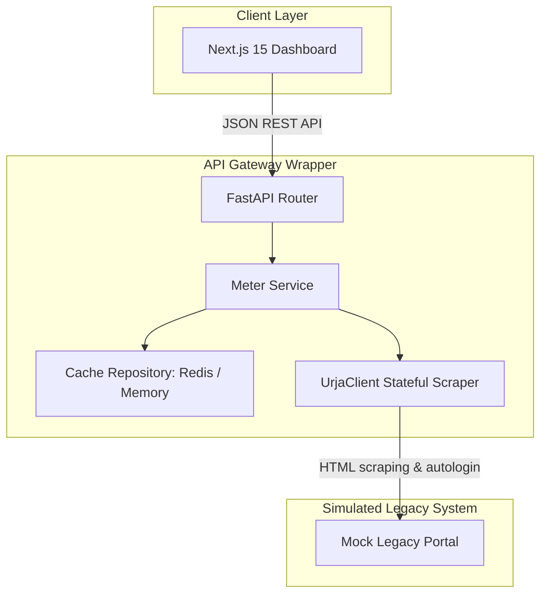

# Flock Energy - Legacy Telemetry API Wrapper & Dashboard

This repository contains a production-grade, asynchronous REST API wrapper built over the legacy Urja Meter Ops utility portal, alongside a premium Next.js 15 analytics dashboard.

---

## Architecture Overview

The system is structured as a monorepo adhering to clean architecture, repository patterns, and loose coupling via dependency injection:



- **Backend (Python 3.12 + FastAPI + HTTPX + BS4):** Normalizes the legacy raw HTML layout structure into clean JSON objects validated via Pydantic v2. Maintains stateful session connection tracking, automated background CSRF negotiation, and re-authentication.
- **Frontend (Next.js 15 + TypeScript + TailwindCSS + Recharts + Leaflet):** High-fidelity premium SaaS web dashboard featuring dynamic animations, command palette, grid hierarchy trees, dark mode, geo-coordinates placement map, and logs simulation control.
- **Caching Layer:** Redis cache with a transparent, graceful asynchronous in-memory dictionary failover if Redis is offline.

---

## Directory Structure

```
├── backend/            # FastAPI wrapper API & mock portal service
│   ├── app/            # Core wrapper logic (adapters, services, schemas)
│   ├── mock_portal.py  # Mock Urja Legacy website simulator
│   ├── tests/          # Pytest backend validation suites
│   └── requirements.txt
├── frontend/           # Next.js 15 dashboard app
│   ├── app/            # App Router views & globals
│   ├── components/     # Custom animated glass cards, maps, charts
│   └── lib/            # API queries
├── docs/               # Architecture documents
├── docker/             # Production container Dockerfiles
├── docker-compose.yml  # Local multi-service orchestration
├── openapi.json        # Static OpenAPI spec dump
├── PROTOCOL.md         # Scraping and cookie handshake specification
└── REFLECTION.md       # Engineering log & self-review
```

---

## Setup & Local Installation

### Prerequisites

- Python 3.12+
- Node.js 20+
- Docker & Docker Compose (for orchestrated running)

### Option 1: Running with Docker Compose (Recommended)

1. Launch all services (Redis, Mock Portal, API Wrapper, and Frontend):
   ```bash
   docker-compose up --build
   ```
2. Access the systems:
   - **Premium Dashboard UI:** `http://localhost:3000`
   - **FastAPI Swagger Spec:** `http://localhost:8000/docs`
   - **Mock Legacy Portal:** `http://localhost:8001/legacy/login` (Credentials: `admin` / `password123`)

### Option 2: Running Services Locally

#### Step 1: Start Backend Scraper & Mock Portal
1. Navigate to the backend folder and create a virtual environment:
   ```bash
   cd backend
   python -m venv venv
   .\venv\Scripts\activate
   pip install -r requirements.txt
   ```
2. Launch the Mock Legacy Portal (simulating the client source website) on port `8001`:
   ```bash
   uvicorn mock_portal:app --host 127.0.0.1 --port 8001
   ```
3. In a separate terminal session (with activated virtual env), launch the main API wrapper:
   ```bash
   uvicorn app.main:app --host 127.0.0.1 --port 8000
   ```

#### Step 2: Start Next.js Frontend
1. Navigate to the frontend directory:
   ```bash
   cd frontend
   npm install
   npm run dev
   ```
2. Open `http://localhost:3000` in your web browser.

---

## REST API Examples

### 1. Authenticate with wrapper and test connection
`POST /api/v1/auth/login`
```json
{
  "username": "admin",
  "password": "password123"
}
```
**Response:**
```json
{
  "success": true,
  "message": "Authenticated successfully with wrapper and legacy portal",
  "token": "flock_energy_session_token_secure_jwt_mock"
}
```

### 2. Retrieve inventory of meters
`GET /api/v1/meters`

**Response:**
```json
[
  {
    "id": "1",
    "serial_number": "FLK-001",
    "location": "Indiranagar, Bangalore",
    "latitude": 12.971897,
    "longitude": 77.641151,
    "phase": "Three Phase",
    "installation_date": "2024-01-15",
    "status": "Active"
  }
]
```

---

## Trade-offs & Limitations

1. **Stateful Connections:** Web scraping requires holding active HTTP connection pools. If the legacy portal runs in multiple cluster instances behind sticky load balancers, the wrapper client needs sticky routing or Redis-backed session token sharing.
2. **HTML Parsing Fragility:** Scraping is structurally dependent on HTML tags. Any update to the legacy portal's HTML tree (e.g. changing CSS class names) can break the BeautifulSoup selectors. This is mitigated by Pydantic schema validation which reports exceptions immediately.

---

## Future Improvements

- **Asynchronous Scheduler (Celery):** Replace query-time scraping with a background task runner that periodically polls the legacy portal and saves changes to a database, reducing REST latency to sub-milliseconds.
- **WebSocket Streaming:** Expose raw websocket endpoints on the wrapper to stream updates to the frontend dynamically as they are scraped.
